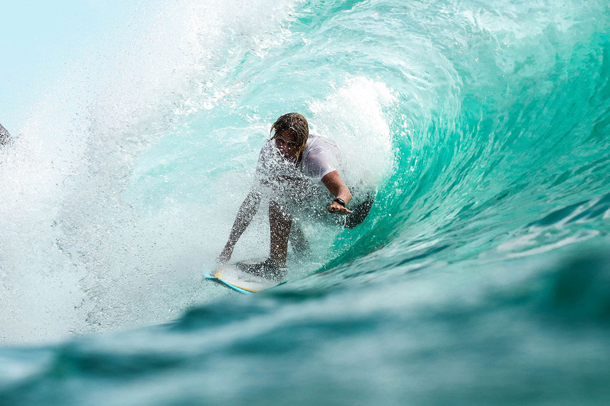

so, I dont know how the layout = post works, or images, but for markdown we can have:
# this is a heading
## here a smaller one 
### can we have one following the other
doing It change if I have 2 lines with a orizontal space? I guess it depends 
on the space of the lines in text avaiable

##### the number of word we got

like this?  or maye not To most of you, he has no name. He is the Poggers guy. or the Pogchamp guy. Or
something else of the nature. But to those who know his story better, Gootecks is a man who's story is that of
a great tragedy. In this video, we will kickstart a new era of Fallen Titans by 
exploring that very story.
Who is the Poggers Guy? What does Poggers mean? And why has 
Twitch now banned their most popular emoticon? Today, all of these answers will be questioned. I stayed up for 26 hours making this video, here's some tags.

#### so, we have the stuff here

is best practice to have a line from the heading, there is gonna be space aleady bt still do t in .md

so, to have a line as with br.  
will the space work? kinda, its used to get a break of the line  
does it work?

or also you can use 
kinda but not really, for the html tag is supported

and for the **bold** we ca have asteriks.  
and for italiks we have a smaller number of asterics *not needed*

and we can have ***double kinda*** on bold and italic

> and with this we have a block of stuff ***kinda***

and with this we can have *multiple paragraph*
>Here the first part
>
>Is this playing in reverse

and what if we get the nested quotes

>So this is the first line of  
>and what about this other BUT to have blanck lines we still need the space
>
>>This is the super focused quotes

- is this a part  
- but what if multiple

>### this is the title of the quote
>we got the **the text** kinda but  
>
>>this is the text that is more focused  
>
>with this being the ***end*** and you may need to add a blank line after the focused

so, for numbered list we just need numbers, not even in order:  

1. so, this is one
1. this s the second
1. is this the second
    1. well actually no, we got the space
    1. this also we have the spacies
1. is this another

- so, this is the list  
- is the space needed?
- do we need more? and we need to fill all the -
    - yes
    - this is the white stuff
- maybe this will not add up

and also we have a line o stuff

- still also  
- and what about this  

    this ine will be displayed with the previous element and change the layout

- are you sure?
- kinda ?
- and what about this

now, imagine having a list with elements and blockquotes:

- this is the first
- this is the 2
> and what about this
- and else?
- indeed

### say hello to the code posted

        <html>
          <head>
            <title>Test</title>
          </head>

> can you see it?

and what about images we have:

1. Open the file containing the Linux mascot.
2. Marvel at its beauty.

    

3. I will see if its possible to change some style of it

1. is this the one
1. well depends
- this 2 should be white
- actually maybe
1. oltre il visione

***

we also get a orizontal rule with the asterisks  
can we have a special word like this `nano`

``so here we have a text that is a code I guess `except this` kinda 
 is this the thing 
``

also it seems we can have 2 lines

---

I guess? without indent space

imagine unironically being a fan of *[this](https://lily-orchard.tumblr.com/page/5)*  
what about a link with a hover title [**duck**](https://lily-orchard.tumblr.com/page/5 "the blog you may need to read")

maybe here  

imagine having a random email here <mrlzarate8@gmail.com>

so, to have a different way to handle the link:

imagine liking [this][1]

[1]: <https://lily-orchard.tumblr.com/page/5> "a woman you ned to listed to"

some elements like astericks \* or \# could be processed by markdown BUT we can use \\ to see them